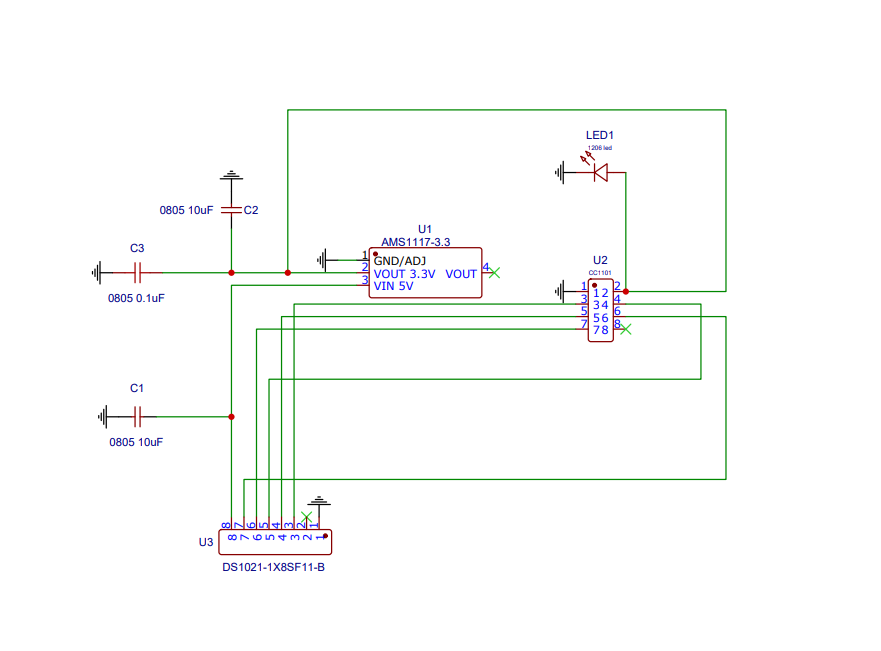
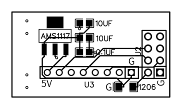
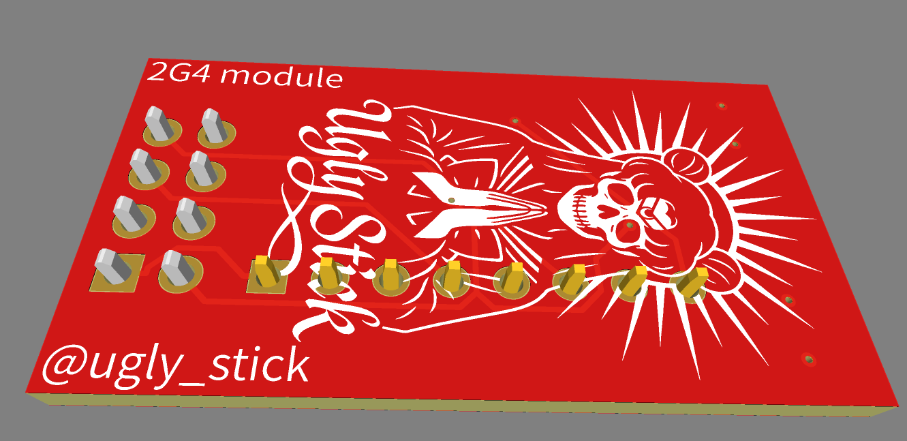

# FZNRF24UGLYPCB
NRF24 Module for Flipper Zero
<h1 align="center"><b>FZNRF24UGLYPCB</b></h1>

  <strong>FZ1101UGLYPCB</strong> – NRF24 (E01-2G4M27D) commutation PCB project for Flipper Zero

  

  

  

  

  

<h2><b>BOM:</b></h2>

<table align="center" width="100%" border="1" cellspacing="0" cellpadding="6">
  <thead>
    <tr>
      <th align="left">POS</th>
      <th align="left">PN</th>
      <th align="left">MFG</th>
      <th align="left">QTY</th>
      <th align="left">ANNOTATION</th>
    </tr>
  </thead>
  <tbody>
    <tr>
      <td>U1</td>
      <td>AMS1117-3.3</td>
      <td>Advanced Monolithic</td>
      <td>1</td>
      <td>(or analog in SOT-223 case)</td>
    </tr>
    <tr>
      <td>U3</td>
      <td>DS1021-1*8SF11-B</td>
      <td>Connfly</td>
      <td>1</td>
      <td>PLS-8 (common naming)</td>
    </tr>
    <tr>
      <td>LED1</td>
      <td>KPTR-3216ZGC</td>
      <td>Kingbright</td>
      <td>1</td>
      <td>(or any other 3.3V LED in 1206 case or add Resistor)</td>
    </tr>
    <tr>
      <td>C1, C2</td>
      <td>GRM21BR61A106KE19L</td>
      <td>Murata</td>
      <td>2</td>
      <td>(or any other 10uF capacitor in 0805 case)</td>
    </tr>
    <tr>
      <td>C3</td>
      <td>GRM21BR71H104KA01L</td>
      <td>Murata</td>
      <td>1</td>
      <td>(or any other 0.1uF capacitor in 0805 case)</td>
    </tr>
    <tr>
      <td>U2</td>
      <td>E01-2G4M27D</td>
      <td>EBYTE</td>
      <td>1</td>
      <td>(2.4G wireless module)</td>
    </tr>
    <tr>
      <td>—</td>
      <td>FZNRF24UGLYPCB</td>
      <td>ugly_stick</td>
      <td>1</td>
      <td>(or DIY board)</td>
    </tr>
  </tbody>
</table>

